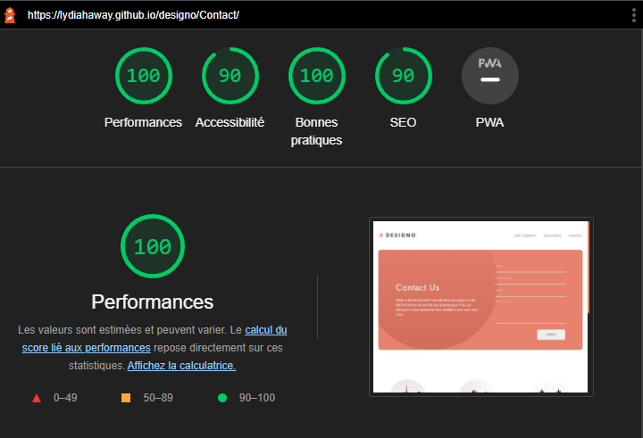

# designo

## Introduction

We made a group project, learning how to use correctly HTML and SASS to build a design given for a website. We had to fallow a layout on a [figma file](https://www.figma.com/file/l95gv4piXhWCegSRZIXe3y/designo-becode?node-id=0%3A1).

For this project, we were three, [Lydia Haway](https://github.com/LydiaHaway), [Mehdi Habaru](https://github.com/Mirodeon) and [Henri Hals](https://github.com/henrihals).

You can fallow this [link](https://lydiahaway.github.io/designo/).

## Test SEO

Here's an exemple of the lighthouse for one of our pages.

## Technologies

HTML, SASS, JS
